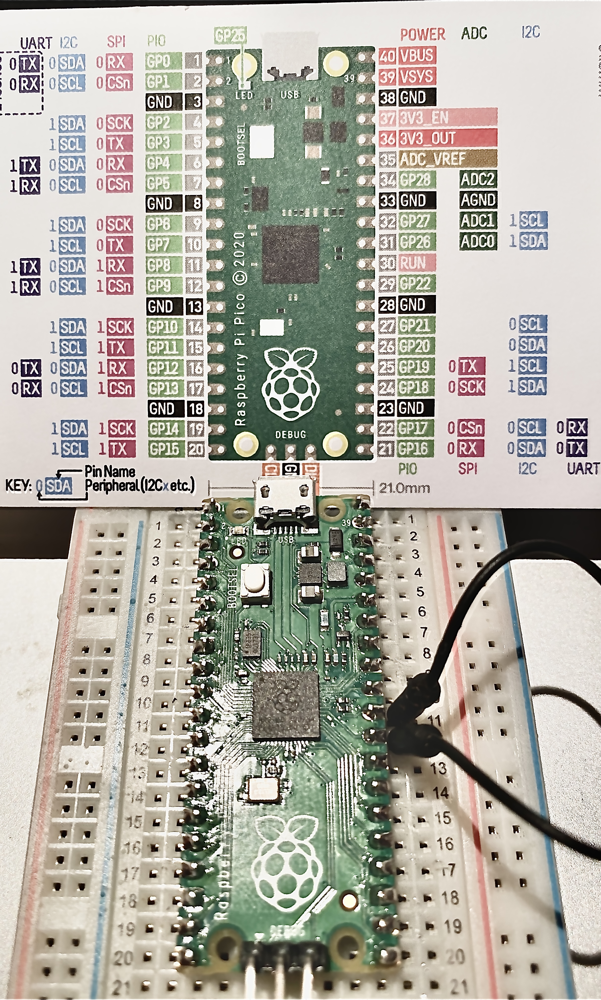

Las Raspberry PICO (2020), se cargó Circuit-Python usando las recomendaciones de DronBot (https://www.youtube.com/watch?v=07vG-_CcDG0)

## BREVE INSTALACION
> Para efecto se descargo en la PC el firmware para cambiar de MicroPython/C++ a esta versión de la ruta:

https://circuitpython.org/board/raspberry_pi_pico/

 
1. Se pone un cable en pin RUN mas Tierra haciendo corto.
2. Conecta el cable MicroUSB a la Computadora
3. Presiona el boton BootSEL y no soltarlo
4. Soltamos la tierra del cable antes mencionado
5. Solamos el boton BootSEL

> Arrastrar (drago/drop) el archivo descargado UF2 a el "Pico Drive" presente el en explorador y esperamos 1 minuto aprox.


> Instalar el Editor sencillo llamado MU-Editor
 https://codewith.mu
 
 
 
## Blink en CircuitPython

```python

"""Example for Pico. Blinks the built-in LED."""
import time
import board
import digitalio
 
led = digitalio.DigitalInOut(board.LED)
led.direction = digitalio.Direction.OUTPUT
 
while True:
    led.value = True
    time.sleep(0.5)
    led.value = False
    time.sleep(0.5)
```

Y hará blink la Raspberry Pico.


